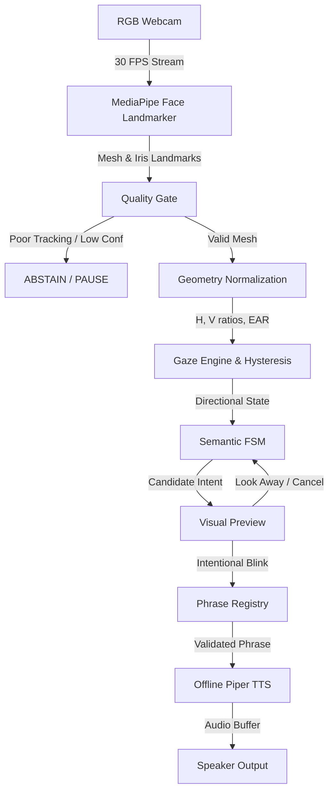

# VoxGaze Architecture Specification

## 1. System Pipeline Overview
VoxGaze maps coarse, deliberate physical eye movements to deterministic communication intents:

---

## 2. Module Responsibilities & Boundaries

To preserve strict separation of concerns, modules have single responsibilities:
- **`backend/app/perception/geometry.py`**: Pure mathematical functions. Calculates distances, local $H, V$ eye axis coordinates, and Eye Aspect Ratio ($EAR$). Zero knowledge of cameras, OpenCV, or UI.
- **`backend/app/calibration/service.py`**: Handles calibration data collection windows, sample filtering, median/MAD computation, outlier rejection, quality checking, and profile serialization.
- **`backend/app/perception/gaze_engine.py`**: Consumes `GazeFeatures` and active `CalibrationProfile`, executes dual-threshold hysteresis, and outputs `GazeState`.
- **`backend/app/interaction/fsm.py`** *(Milestone M1.5+)*: Finite-state machine managing transitions between `IDLE`, `DOMAIN_SELECTED`, `PREVIEW`, and `CONFIRMED`.
- **`backend/app/intent/registry.py`** *(Milestone M1.5+)*: Reads `config/default_intents.json` and deterministically resolves phrases.
- **`backend/app/speech/tts_engine.py`** *(Milestone M1.5+)*: Invokes local Piper TTS process on confirmed phrases.

---

## 3. Bilateral Eye Feature Support
Milestone M1 extracts the primary left eye features while exposing the bilateral schema in [docs/data-contracts.md](file:///d:/VOXGAZE/docs/data-contracts.md). This allows right-eye tracking and head pose integration without modifying downstream classifiers or state machines.

---

## 4. State Machine Transition Table
The interaction protocol enforces the following transition guarantees:

| Current State | Input / Event | Guard / Condition | Next State | Action / Output |
| :--- | :--- | :--- | :--- | :--- |
| `IDLE` | `DIRECTION (UP/DOWN/LEFT/RIGHT)` | Valid intent available | `PREVIEW` | Display candidate phrase |
| `IDLE` | `BLINK` | None | `IDLE` | No action (prevent accidental speech) |
| `PREVIEW` | `CONFIRM_BLINK` | $300\text{ ms} \le t \le 800\text{ ms}$ | `CONFIRMED` | Trigger deterministic speech |
| `PREVIEW` | `LOOK_AWAY` | Opposite or escape direction | `IDLE` | Cancel preview (no speech) |
| `PREVIEW` | `TIMEOUT` | Inactivity $> 3000\text{ ms}$ | `IDLE` | Reset candidate |
| `ANY` | `TRACKING_LOST` | Face missing / low confidence | `ABSTAIN` | Pause interaction, preserve state |
| `ABSTAIN` | `TRACKING_RECOVERED` | Stable landmarks detected | Previous State | Resume interaction |
| `CONFIRMED` | `SPEECH_DONE` | TTS buffer finished | `IDLE` | Clear active selection |
